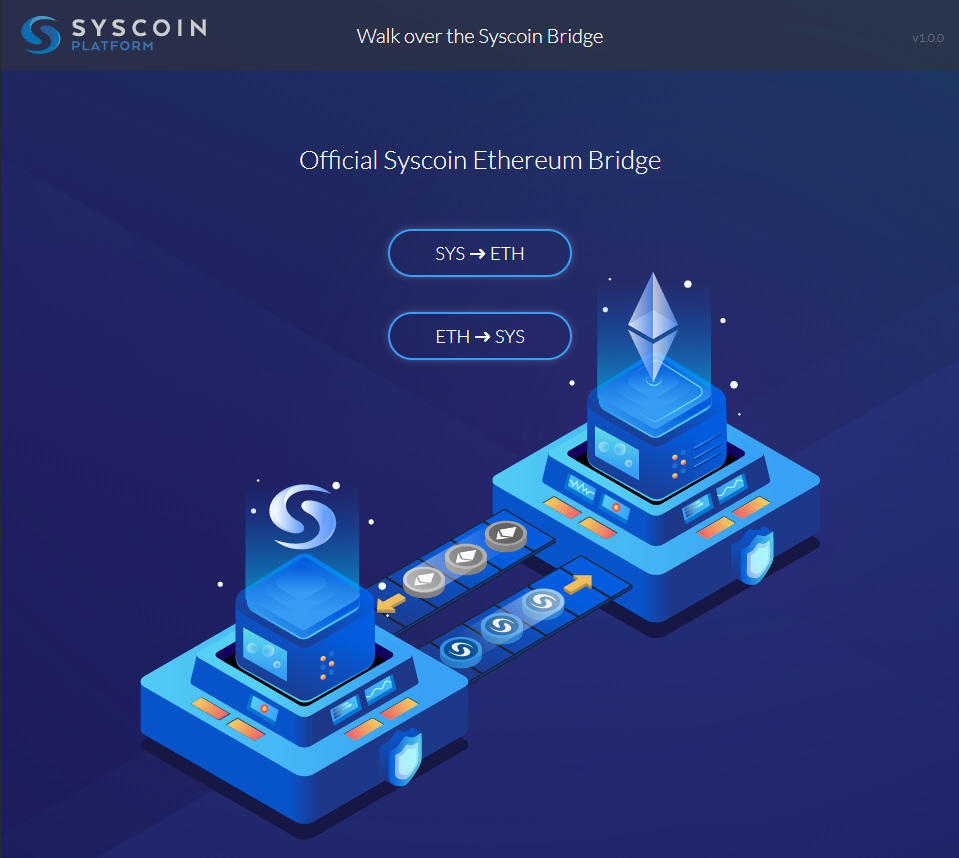
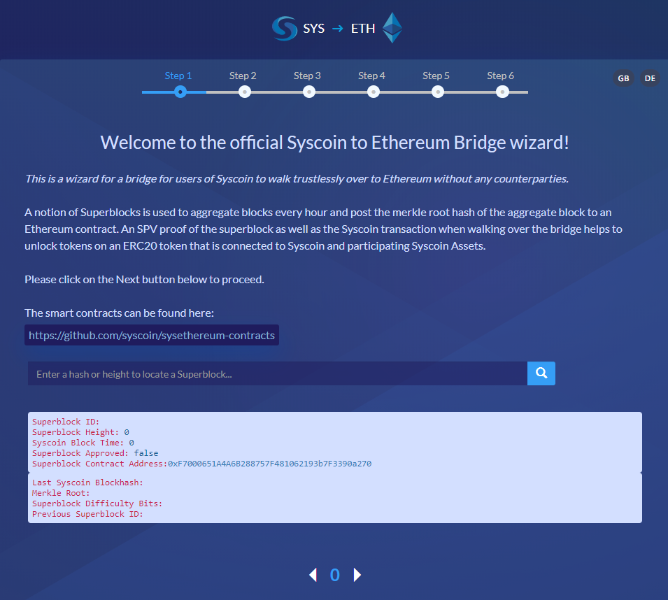

## Sysethereum DAPP
This is a reference implementation of a user interface showcasing the Syscoin <=> Ethereum bridge. It will create a SPV proof of Syscoin burn transactions as well as a SPV proof of a Superblock and post to the Superblock smart contract which will validate and call a Token contract which extends SyscoinTransactionProcessor (depending on if its an asset it will call the right contract based on the details in the burn transaction). The Token contract will mint tokens into existence based on the details of the burn transaction.

On the way back to Syscoin. An SPV proof of the Ethereum transaction is created using [eth-proof](http://github.com/syscoin/eth-proof) and will call a burn function from the SyscoinTransactionProcessor base of the Syscoin Token contract that holds the minted tokens. It's purpose is to burn tokens and the function parameters are used via ABI data to detect the value of the burn once Syscoin consensus reads the transaction data.

Syscoin itself enforces the SPV proof by running Geth in light mode to sync up to the last few weeks of headers on Ethereum. It uses a NodeJS relayer which is compiled as a binary and launched when Syscoind is run. The relayer connects to Ethereum using a websocket connection and pushes Transaction Roots of Ethereum headers to Syscoin core which saves a tuple of Ethereum Blockheight, Transaction Roots into a database. The Transaction root is queried for when a Syscoin mint transaction is created (when Ethereum contract burns Syscoin tokens on the ERC contract). The calculated Transaction Root must match the Transaction Root saved in the database which validates that the Ethereum transaction was valid and subsequently minting new Syscoin or Syscoin assets into existence. The total supply of Syscoin/Syscoin assets should remain constant throughout the process as the bridge represents a zero-sum game.

## Dependencies

1) You should be running a [Syscoin Agent](https://github.com/syscoin/sysethereum-agents) which is used to get SPV Superblock proofs aswell as query for Superblocks in general. 
2) You should be running [Syscoin Core](https://github.com/syscoin/syscoin). You should configure the RPC parameters for the dapp to talk to Syscoin Core. This is done via the syscoin.conf file in your Syscoin data directory.
3) You should configure `config.js` to point to the Agent and Syscoin core authentication, URL, and ports.

## Available Scripts

In the project directory, you can run:

### `npm start`

Runs the app in the development mode. 
Open [http://localhost:3000](http://localhost:3000) to view it in the browser.

The page will reload if you make edits. 
You will also see any lint errors in the console.

### `npm test`

Launches the test runner in the interactive watch mode. 
See the section about [running tests](https://facebook.github.io/create-react-app/docs/running-tests) for more information.

### `npm run build`

Builds the app for production to the `build` folder. 
It correctly bundles React in production mode and optimizes the build for the best performance.

The build is minified and the filenames include the hashes. 
Your app is ready to be deployed!

See the section about [deployment](https://facebook.github.io/create-react-app/docs/deployment) for more information.

## Learn More

You can learn more in the [Create React App documentation](https://facebook.github.io/create-react-app/docs/getting-started).

To learn React, check out the [React documentation](https://reactjs.org/).

### Code Splitting

This section has moved here: https://facebook.github.io/create-react-app/docs/code-splitting

### Analyzing the Bundle Size

This section has moved here: https://facebook.github.io/create-react-app/docs/analyzing-the-bundle-size

### Making a Progressive Web App

This section has moved here: https://facebook.github.io/create-react-app/docs/making-a-progressive-web-app

### Advanced Configuration

This section has moved here: https://facebook.github.io/create-react-app/docs/advanced-configuration

### Deployment

This section has moved here: https://facebook.github.io/create-react-app/docs/deployment

### `npm run build` fails to minify

This section has moved here: https://facebook.github.io/create-react-app/docs/troubleshooting#npm-run-build-fails-to-minify
